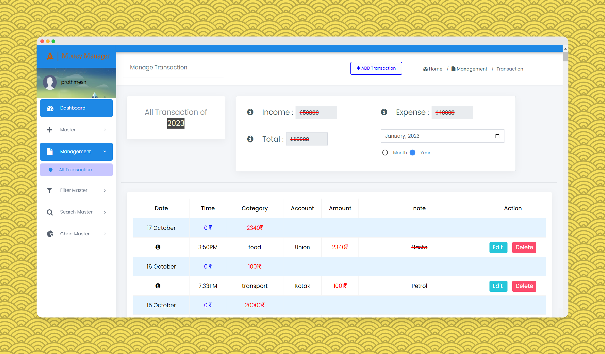

<p id="top" align="center">
  <a href="https://money-manager.prathmeshsoni.works/">
    
  </a>
</p>

<h1 align="center" class="dotted">
    <a href="https://money-manager.prathmeshsoni.works/">Money Manager</a>
  
<p align="center">

<br>
  


<a href="https://github.com/PrathmeshSoni">

</a> 

</p>

</h1>

Welcome to Money Manager, your digital financial assistant! Streamline personal finance with ease using Django and MySQL for effective budgeting and expense tracking.

# Live Demo 👇:

https://money-management.prathmeshsoni.works/

<br>

## Table Of Contents :

* [About the Project](#About-The-Project)
* [Technologies Used](#technologies-used)
* [Features](#Features)
* [Getting Started](#Getting-Started)
  * [Prerequisites](#Prerequisites)
  * [Installation](#installation)
* [Credentials](#Default-Credentials)
* [Screenshots, Demo Video](#Screenshots)
* [Connect Me](#Connect-with-me-at)

## About The Project



Welcome to Money Manager, a streamlined web application designed to simplify personal finance management. Built with Django and MySQL, this full-stack tool empowers users with effective budgeting and expense tracking capabilities, providing a comprehensive view of financial health.

## Technologies Used

- Backend: Python with Django framework
- Frontend: HTML, CSS, Bootstrap for a responsive and visually appealing interface
- Interactivity: JavaScript, jQuery, AJAX for seamless user experience
- Database: MySQL for data management


## Features

- User-Friendly Interface: Designed for simplicity and ease of use.
- Comprehensive Financial Management: Budget creation, expense tracking, and financial reporting in one place.
- Real-Time Insights: Instantly analyze and understand spending habits.

## Getting Started

This is an example of how you may give instructions on setting up your project locally.
To get a local copy up and running follow these simple example steps.

### Prerequisites
Install Python 3.7 or above

*  [Python](https://python.org/downloads/)

### Installation

> 👉 **Step 1** - Download the code from the GH repository (using `GIT`):
```bash
git clone https://github.com/prathmeshsoni/Money-Management.git
cd Money-Management
```

<br />

> 👉 **Step 2** - Create virtual environment:
```
python -m venv .venv
```

<br />

> 👉 **Step 3** - Activating the environment:

on Windows:
```bash
.venv\Scripts\activate.bat
```
on Mac OS / Linux:
```bash
source .venv\Scripts\activate
```

<br />

> 👉 **Step 4** - Installing dependencies:

```bash
pip install -r requirements.txt
```

<br />

> 👉 **Step 5** - Go `config.py`


Go to `config.py` file on Money-Management folder (`/wallet/config.py`) setting all requirements after "=". 

```
email = ''
password = ''
```

<br />

> 👉 **Step 6** - You can now run the development server:

```bash
python manage.py runserver
```

Visit [`http://127.0.0.1:8000`](http://localhost:8000) in your browser. The app should be up & running.

<br />

## Default Credentials

- **User Credentials:**
  - Username: admin
  - Password: admin@123


## Screenshots

Visit our [Screenshots Page](https://private-app.prathmeshsoni.works/view/115) for a visual walkthrough of the Money Manager Website.

Demo Video 👇:


<br />

The repository is a start point for most of my professional projects; for this, I'm using as a part of my portfolio, feel free to use wherever you want. I'll be happy if you provide any feedback or code improvements or suggestions.

## Connect with me at

<p align='center'>
    
  <a href="https://www.linkedin.com/in/prathmeshsoni/">
    
  </a>
  
</p>

<p align='center'>
  📫 How to reach me: <a href='mailto:connect.prathmeshsoni@gmail.com'>connect.prathmeshsoni@gmail.com</a>
</p>

## All Set :)

<p><a href="#top">Back to Top</a></p>


---
**[Money Manager](https://money-manager.prathmeshsoni.works/)** - Provided by **[Prathmesh Soni](https://prathmeshsoni.works/)**